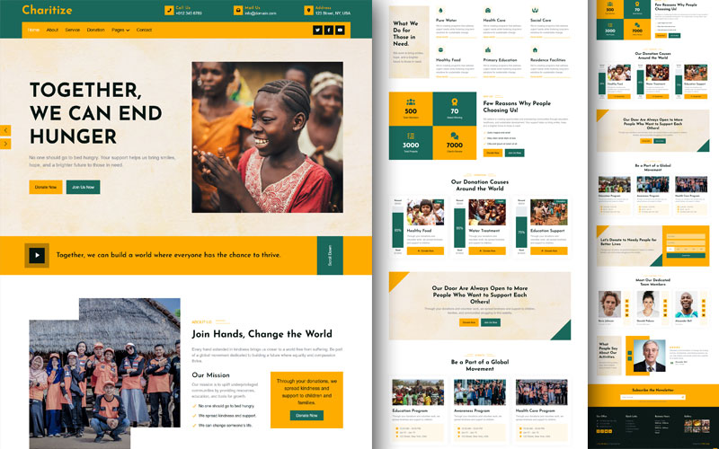

# Charitize 🌍

A multi-page charity organization website built with **HTML**, **CSS**, and **JavaScript** — powered by Bootstrap 5.


## Live Demo
🔗 [View the Live Demo](https://charitize-site.netlify.app/)  

## Features
- Responsive layout with Bootstrap 5 grid
- Scroll-triggered counter animations (IntersectionObserver)
- Animated donation progress bars
- Hero & testimonial carousels
- YouTube video modal
- WOW.js entrance animations

## Tech Stack
- HTML5  
- CSS3
- Vanilla JavaScript 
- Bootstrap 5
- WOW js

## Getting Started
Clone the repo and open `index.html` in your browser — no build step required.

```bash
git clone https://github.com/EngNada-S/Charity-Organization-Website.git
```
